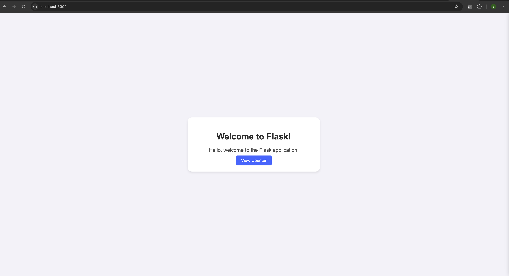
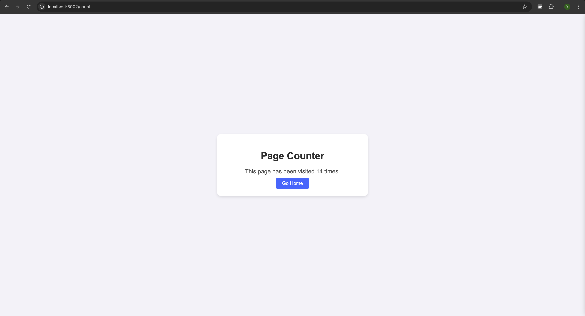

# Project Documentation: Containerising a Flask Application

## Overview

This documentation covers the process of containerising a Flask application using Docker, Docker Compose, Redis, and Nginx. The project involves setting up a basic Flask web application, integrating a Redis-based counter, containerising the application, and deploying it using Docker Compose with load balancing through Nginx.

---

## Project Structure

```
project/
├── app.py               # Flask application
├── requirements.txt     # Python dependencies
├── Dockerfile           # Docker configuration for Flask app
├── docker-compose.yml   # Multi-container orchestration
├── nginx.conf           # Nginx load balancing configuration
└── README.md            # Project documentation
```

---

## Flask Application (`app.py`)

The Flask app provides three routes:

- `/`: Home page with a welcome message.
- `/count`: Counter page that tracks visits using Redis.
- `/hello`: Simple hello world page.

### Key Features:

- Environment variables for Redis host and port.
- Responsive UI with styled HTML templates.
- Counter increment using Redis for persistence.

---

## Dockerfile

The Dockerfile sets up the environment to run the Flask application.

### Steps:

1. **Base Image**: Uses `python:3.8-slim` for a lightweight Python environment.
2. **Working Directory**: Sets `/app` as the working directory.
3. **Install Dependencies**: Copies `requirements.txt` and installs dependencies.
4. **Copy Source Code**: Adds application files to the container.
5. **Expose Port**: Exposes port `5002` to the host.
6. **Run Application**: Executes `app.py` using Python.

---

## Docker Compose (`docker-compose.yml`)

Docker Compose manages multi-container deployment with three services:

### Services:

- **web**: The Flask application.
  - Built from the Dockerfile.
  - Exposes port `5002`.
  - Environment variables set for Redis.
  - Three replicas for load balancing.
- **redis**: Redis server for the counter.
  - Uses the latest Redis image.
  - Data persisted with Docker volumes.
- **nginx**: Acts as a reverse proxy for load balancing.
  - Exposes port `80`.
  - Uses a custom `nginx.conf`.

### Volumes:

- `redis-data`: Persists Redis data across container restarts.

---

## Nginx Configuration (`nginx.conf`)

Nginx balances traffic between the three Flask application replicas. The configuration ensures smooth handling of requests to `/`, `/count`, and `/hello`.

---

## Requirements (`requirements.txt`)

```
flask
redis
```

---

## Running the Application

### Steps:

1. **Build Containers**:
   ```bash
   docker-compose build
   ```
2. **Start Services**:
   ```bash
   docker-compose up
   ```
3. **Access Application**:  
   Open `http://localhost` in your browser.

---

## Testing the Application

- Visit `/` to see the welcome page.
- Visit `/count` to increment and display the counter.
- Visit `/hello` for a simple hello world message.
- Refresh `/count` to observe the counter increment.

---

## Deployment Considerations

- **Scalability**: The `deploy.replicas` setting in `docker-compose.yml` scales the Flask application.
- **Persistence**: Redis data is stored using Docker volumes to prevent data loss.
- **Load Balancing**: Nginx ensures even traffic distribution among the Flask containers.

---

## Conclusion

This project demonstrates how to containerise a Python Flask application with Redis, manage multi-container setups using Docker Compose, and implement load balancing with Nginx. This setup ensures scalability, persistence, and efficient traffic handling.

## Welcome Page



## Count Page


